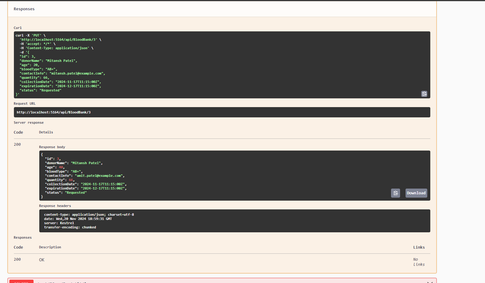
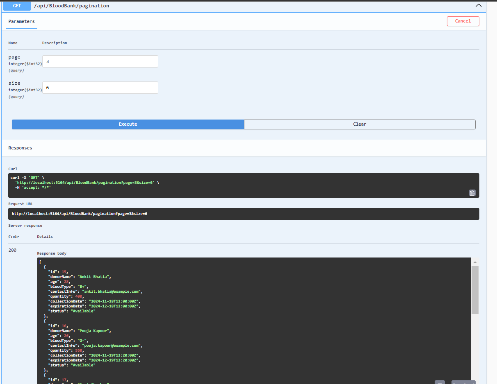

# Blood Bank Management

## How to Run the Project

1. **Clone the repository**    : 
```git clone https://github.com/your-repo/blood-bank-management.git```
```cd blood-bank-management```


2. **Build the project**:
```dotnet build```


3. **Run the project**:
```dotnet run```


4. **Access the API**:
Open your browser or API client (e.g., Postman) and navigate to `https://localhost:5001/api/bloodbank` to start interacting with the Blood Bank Management API.

5. **Run the tests** (if applicable):
```dotnet test```

## Create
**POST /api/bloodbank**: Add a new entry to the blood bank list. The input should include donor details, blood type, quantity, and collection/expiration dates.


## Read All
**GET /api/bloodbank**: Retrieve all entries in the blood bank list.


## Read by ID
**GET /api/bloodbank/{id}**: Retrieve a specific blood entry by its Id.


## Update
**PUT /api/bloodbank/{id}**: Update a specific blood entry by its Id. The input should include donor details, blood type, quantity, and collection/expiration dates.





## Delete
**DELETE /api/bloodbank/{id}**: Delete a specific blood entry by its Id.


## Search by Blood Type
**GET /api/bloodbank/search?bloodType={bloodType}**: Retrieve all entries in the blood bank list with a specific blood type.


## Search by Status
**GET /api/bloodbank/search?status={status}**: Search for blood bank entries by status (e.g., "Available", "Requested").


## Search by Donor Name
**GET /api/bloodbank/search?donorName={donorName}**: Search for donors by name.


## Pagination
**GET /api/bloodbank?page={pageNumber}&size={pageSize}**: Retrieve a paginated list of blood bank entries. The response should show entries based on page number and page size parameters.




